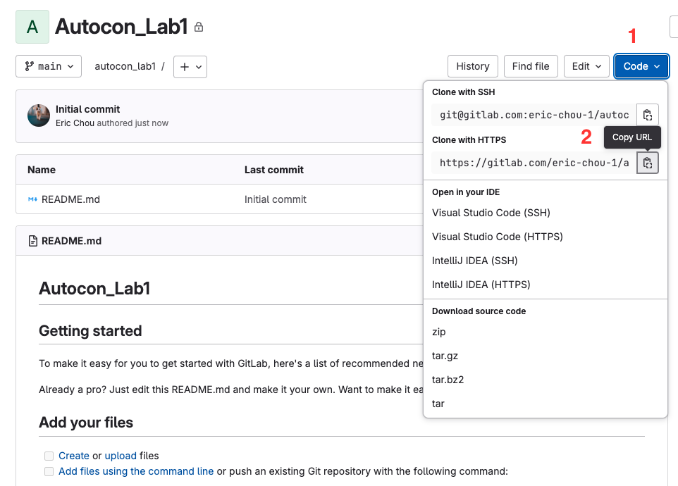

# Lab 1. Basic Git Operations

Git is a powerful version control system used by developers and DevOps engineers to manage and track changes in the code. It allows multiple people to work on the same codebase simultaneously, online or offline, without overwriting each other's work. 

Git takes snapshots of the code and at various points in time and allow each engineer to work on their local copies. 

## GitLab

GitLab is a platform that builds on top of Git to provide more tools for development and collaboration. You might be familiar with GitHub, which is another platform that builds on top of Git. 

When it comes to DevOps, GitLab offers some advantages over GitHub, IMHO: 

- GitLab has a built-in CI/CD environment while GitHub's GitHub Actions requires more setup and needs more third-party integration to be feature-parity with GitLab. 
- GitLab runners were relased around 2011 while GitHub Action was released in 2018. GitLab Runner has been around longer and is arguably more mature than GitHub Action. 
- GitHub has traditionally been focused on code hosting and collaboration while GitLab has been an all-in-one DevOps platform from the beginning with project management, issue tracking, and more. 
- GitLab offers free self-hosting option while GitHub only offers self-hosting with paid tiers.  

Having said that, GitHub offer advantages such as larger community, better integration with Microsoft Cloud, and more cost efficient. Regardless, we will use GitLab as our CI/CD platform. 

## Basic Setup

Let's go ahead and create a new project on GitLab. We can create a new project from the ```+``` sign and pick 'New project/repository':


We will choose to create a blank project: 


Feel free to use any name you'd like, but we will use 'Autocon_Lab1' for the example: 


Once the repository is created, we will use this as our remote source. Take a note of the URL and use the clip board to copy the URL: 



We will come back to our codespace to continue with the basic Git setup. 

```
git config
``` 

## Understanding Repositories

As Git is a distributed technology, any copies of the codebase can be authoritative. While that sounds good on paper, it is confusing and hard to manage when any copy is the 'source of truth'. 

```
git clone 
```

## File Operations 

```
git add
git commit -m 
git push
git log
```

## Branches

```
git branch
git checkout branch
git checkout main
git merge 
```

## Synchronization

```
git pull
```

## Further Resources

Here are some of the resources for further studying of Git: 

- Kirk Byer's [Git for Network Engineeer's Course](https://pynet.twb-tech.com/class-gne.html) class. 
- Book: [Version Control with Git](https://www.amazon.com/Version-Control-Git-collaborative-development/dp/1449316387/)

